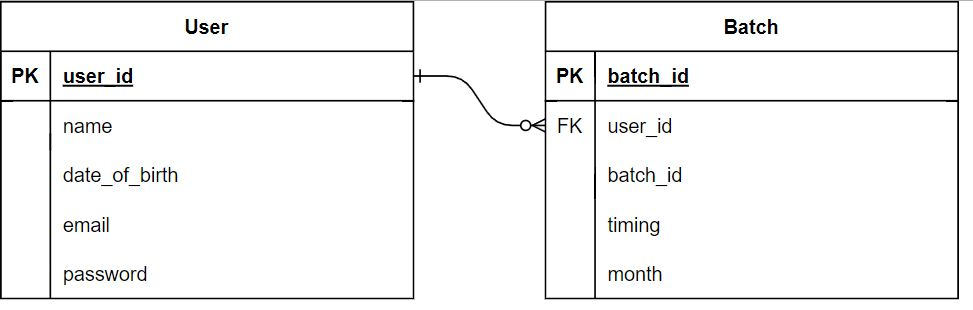

# YogaLand

## ReactJS + ExpressJS + MySQL
## Introduction
This is a simple Yoga Class Booking App. In this project I've used ReactJS for the frontend, ExpressJS for the backend, MySQL for production database

## Features

 The API has minimal features like:
- User Authentication (Login, Signup, Logout)
- Choosing a Batch (6-7AM, 7-8AM, 8-9AM and 5-6PM)
- Changing the Batch (next month)
- A Fake Payment
---
## ER Diagram
)

---

## API Documentation
## How to run this project
### Clone the repository
    git clone https://github.com/abhisheksharmayt/YogaLand.git

### Change the directory
    cd YogaLand

### change the directory to server
    cd sever

### Install the dependencies and start the client
    npm install && npm start

### Add environment variables by renaming the .env.example file to .env

    DATABASE_NAME=<your database name>
    DATABASE_USER=<you database user>
    DATABASE_PASSWORD=<your database password>
    DATABASE_HOST="localhost"
    DATABASE_PORT="3306"
    JWT_SECRET="jwt_secret"
    
### Base URL
    http://localhost:3000/api/
## API Endpoints
|  REQUEST  |  ENDPOINT         |  DESCRIPTION
|    ---    |    ---            |     ---
| POST      | /user/register    | Register user with name, email and password and date of birth
| POST      | /user/login       | Login user with email and password
| GET       | /user/logout      | Logout user
| GET       | /user/me          | Info about the loginned user
| POST      | /batch/join       | Add user to a batch with timing and pay the amount
| PATCH     | /batch/Change     | Change the Batch and Pay the amount
| GET       | /batch/all        | Get all active batches

## Screenshots

